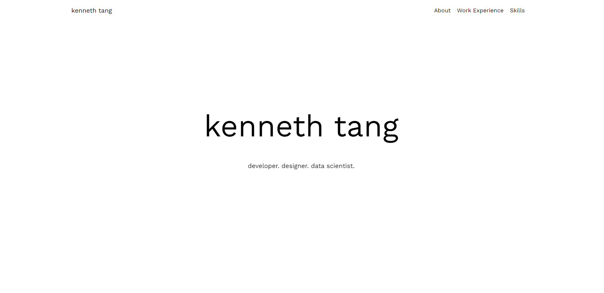
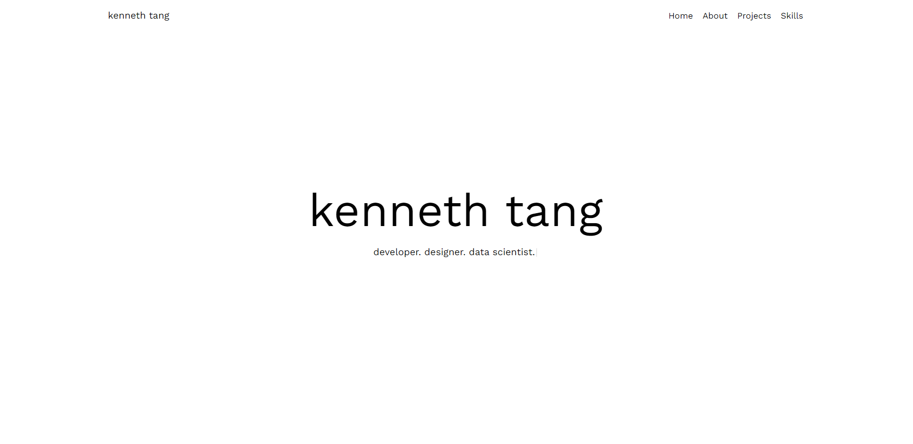

# kennethtang.org

My web portfolio primarily to host my developer projects, photographs, and biographical information.

Static snapshots of each version are saved in this repository.

### [v1.0](v1.0/)

Single page portfolio site with header links to sections.

Developed with ReactJS, TailwindCSS, and NodeJS. Hosted on AWS Amplify and uses AWS Lambda functions and AWS API Gateway to host APIs.

### [v1.1](v1.1/)

Multi page portfolio site that uses React-DOM. Includes project pages and some demos for projects (e.g. [news-api](https://github.com/Kenny477/news-api)).

Uses the same technologies as v1.0.

### v2.0

Currently work in progress.

Migrating to SvelteKit and TailwindCSS. Svelte has become my goto choice for developing fast web applications that don't need the full range of features and reactivity available in frameworks like React.